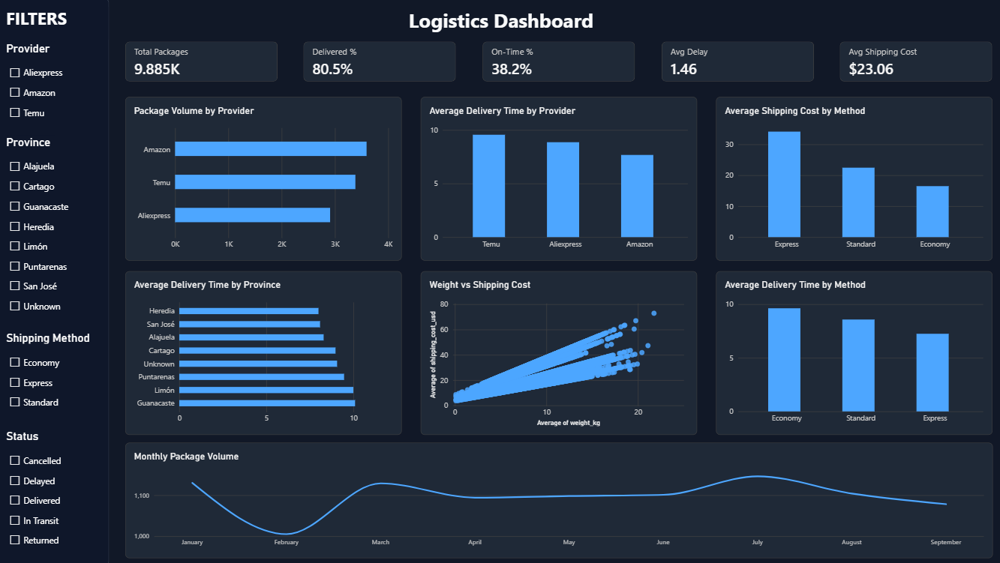

# Logistics Data Analysis

Data analysis project focused on package delivery performance, shipping costs, providers, and destinations using a synthetic logistics dataset.

## Dashboard



## Technologies

* Python
* Pandas
* NumPy
* Matplotlib
* Jupyter Notebook
* Power BI
* DAX

## Project Structure

```text
logistics-data-analysis/
├── data/
├── notebooks/
├── powerbi/
├── reports/
├── src/
└── requirements.txt
```

## Analysis

The project covers:

* Synthetic data generation
* Data cleaning and quality validation
* Exploratory data analysis
* Logistics performance analysis
* Interactive Power BI dashboard

The final dataset contains **9,885 packages** from January to September 2026.

### Main Findings

* Express shipping costs **$34.12** on average and takes **7.25 days**, while Economy costs **$16.49** and takes **9.63 days**.
* Amazon has the highest package volume and shortest average delivery time (**7.67 days**).
* Temu has the lowest average shipping cost (**$16.02**) and longest average delivery time (**9.55 days**).
* Average delivery time ranges from **7.99 days in Heredia** to **10.09 days in Guanacaste**.
* Package weight and shipping cost have a Pearson correlation of approximately **0.69**.
* Monthly package volume remains relatively stable, ranging from **1,005 to 1,146 packages**.

> **Note:** The dataset is synthetic and does not represent real operational data from Amazon, Temu, or AliExpress.
